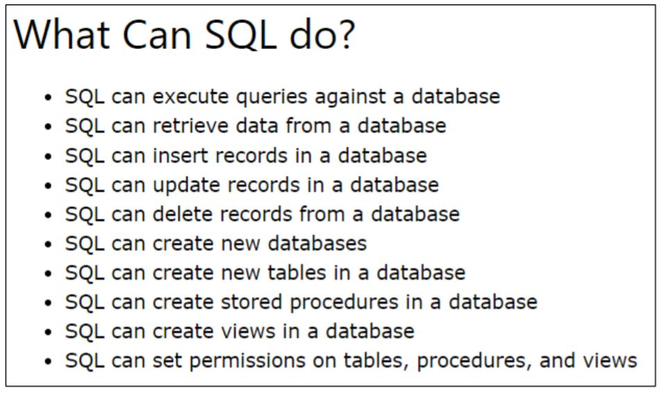

## INTRODUCTION TO SQL

SQL stands for Structured Query Language and is the standard language used in a
Relational Database Management System (RDBMS). SQL is used to communicated with the
database and perform necessary operations such as update existing data (or) retrieve data.

A database generally comprises of multiple tables and each table consists of multiple
records (rows) and attributes (columns). SQL helps perform operations on the tables of the
database.


