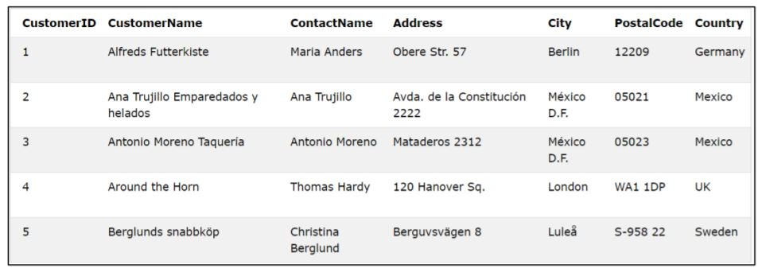
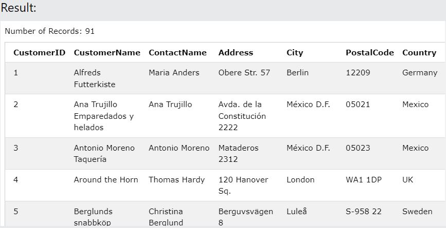
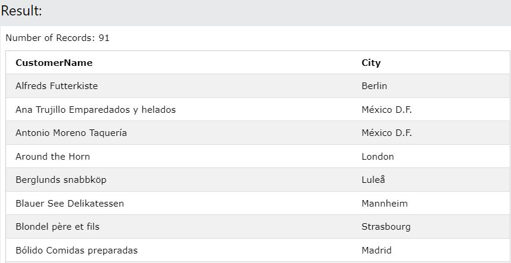
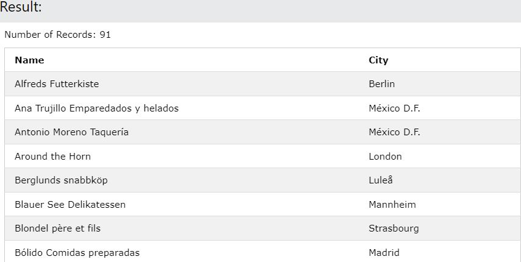
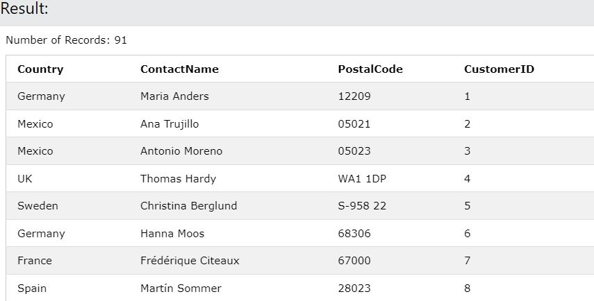
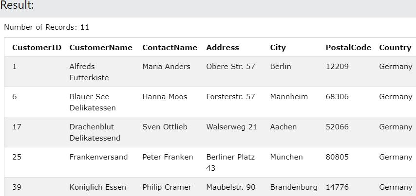
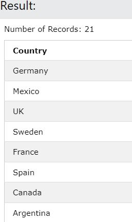
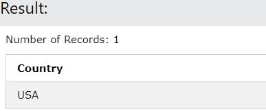
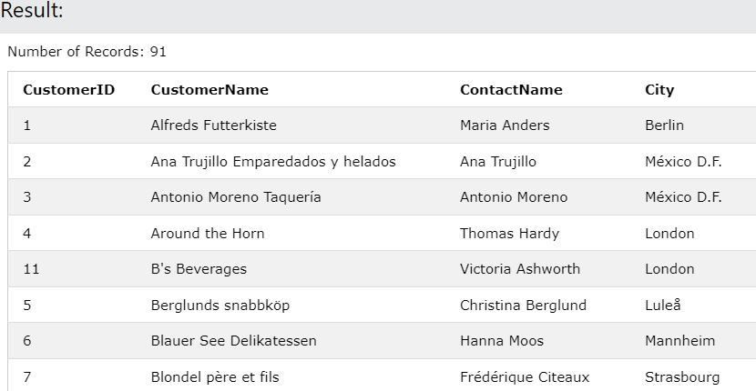
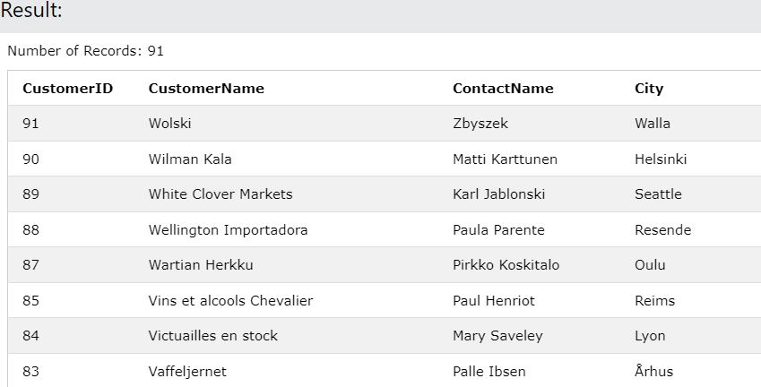

### SELECT:

The SELECT statement is used to indicate what is required to be selected from the table.
To select columns from the table, mention the names of the columns after SELECT keyword. To
select all columns, indicate the asterisk (*) symbol after SELECT keyword.

Important Note – The SQL statement keywords are NOT case-sensitive and hence the keywords
select and SELECT are treated the same way.

Consider the below table called Customers which contains details about various customers. (Only
first five rows are shown)



| Syntax | Description |
| --- | --- |
| SELECT * FROM table_name | Will select all the columns from the table |
| SELECT column1, column2,... FROM table_name | Will select only the specified columns from the table |
| SELECT column1 AS new_name FROM table_name | Selects only the specified column but renames the column to the new_namewhile displaying the result |

Selecting all the columns

```sql
SELECT * FROM Customers
```


Basically, we are saying show me all the columns (*) from the table Customers.

Selecting particular columns

```sql
SELECT CustomerName, City FROM Customers
```


Renaming columns for display
```sql
SELECT CustomerName AS Name, City FROM Customers
```


Result columns are displayed in the order specified
```sql
SELECT Country, ContactName, PostalCode, CustomerID FROM Customers
```


### WHERE:

The WHERE keyword is used to specify conditions. This keyword is used when you need to retrieve information matching certain conditions.

Syntax

```sql
SELECT columns FROM table_name WHERE condition
```

```sql
SELECT * FROM Customers WHERE Country="Germany"
```


**Note** : While using strings, the inverted commas ("string") needs to be used.

### DISTINCT:

The DISTINCT keyword  is  used  to  select  and  display  all  the  unique  values  under  the specified column. The keywords in SQL can be combined to get necessary results based on what kind of results which is required. For example, to identify all the different countries in the table, to identify the different departments where employees work in a employee table etc.


Syntax

```sql
SELECT DISTINCT column_name FROM table_name
```

```sql
SELECT DISTINCT Country FROM Customers
```



```sql
SELECT DISTINCT Country FROM Customers WHERE Country="USA"
```


### ORDER BY:

The ORDER BY keyword is used to display the results in a particular order. You can specify the name of the column (or) a number indicating the column position based on which the results need to be ordered. By default, the results are ordered in ascending order but can be changed to descending using DESC keyword. Ordering can also be done based on more than one column.

Syntax

ASCENDING ORDER

```sql
SELECT column_name FROM table_name ORDER BY column_name/column_number
```

DESCENDING ORDER
```sql
SELECT column_name FROM table_name ORDER BY column_name/column_number DESC
```

FIRST COLUMN DESCENDING AND SECOND COLUMN ASCENDING
```sql
SELECT column_name FROM table_name ORDER BY column_1 DESC, column_2
```

FIRST COLUMN ASCCENDING AND SECOND COLUMN DESCENDING
```sql
SELECT column_name FROM table_name ORDER BY column_1, column_2 DESC
```

Examples:

```sql
SELECT CustomerID, CustomerName, ContactName, City FROM Customers ORDER BY CustomerName
```


```sql
SELECT CustomerID, CustomerName, ContactName, City FROM Customers ORDER BY CustomerName DESC
```


## Aliases

SQL aliases are used to give a table, or a column in a table, a temporary name. Aliases are often used to make column names more readable. An alias only exists for the duration of that query.

An alias is created with the AS keyword.

Syntax

```sql
SELECT column_name AS alias_name FROM table_name
```

```sql
SELECT CustomerID AS ID, CustomerName AS Customer
FROM Customers;
```



