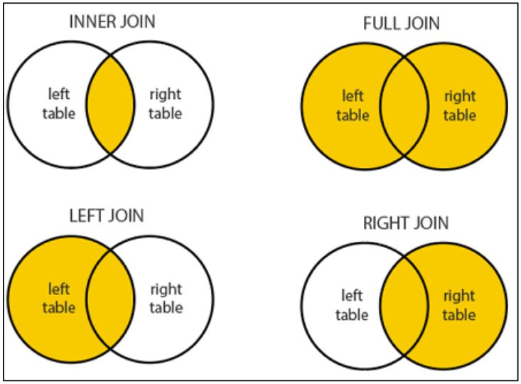
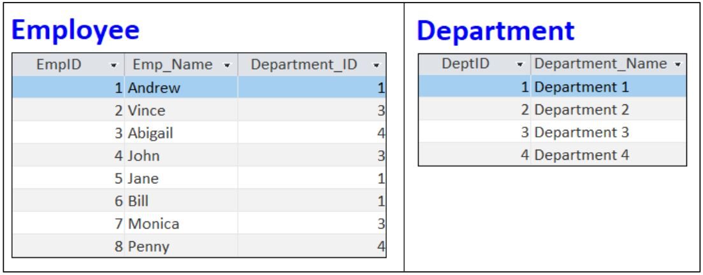
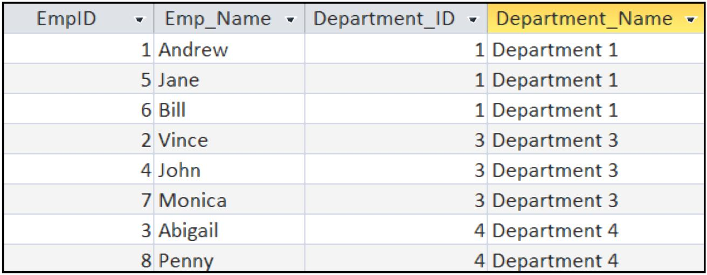
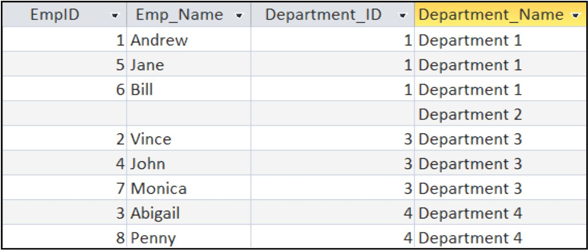
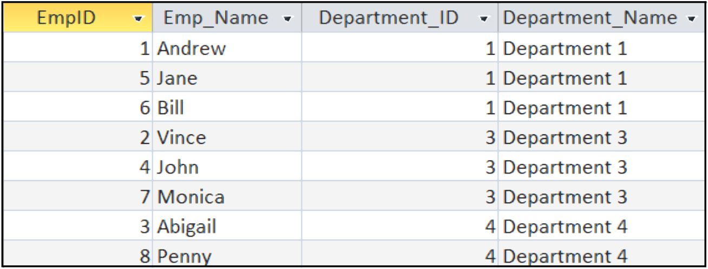
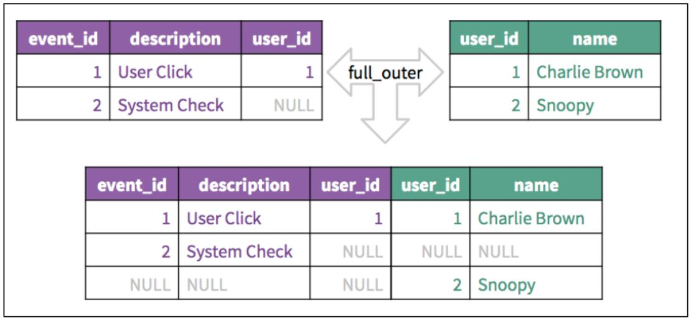
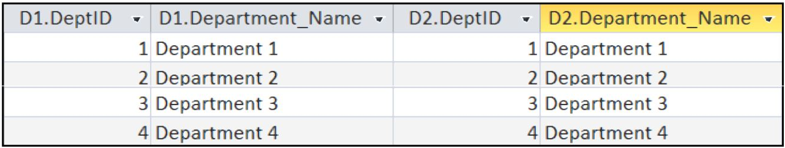

## JOINS

A database generally comprises of multiple tables and a RDBMS comprises of tables which are related. When data is required to be extracted from two or more tables which are related to each other then we perform a join to combine the tables first and then extract the result.


Consider the below two tables which will be used for upcoming examples


### INNER JOIN:

The INNER  JOINcombines  tables  and  returns  the  records  only  when  there  is  an  exact match between the columns on which the join is performed.

#### Syntax:

```sql
SELECT columns FROM Table1 INNER JOIN Table2 ON Table1.column=Table2.column
```

#### Example:
```sql
SELECT E.EmpID, E.Emp_Name, E.Department_ID, D.Department_Name
FROM Department AS D INNER JOIN Employee AS E
ON D.DeptID = E.Department_ID
```


### LEFT JOIN:

The LEFT JOIN combines tables and returns all the records from the left table. For records where there is no match in the right table it is displayed as a nullSyntax

#### Syntax:

```sql
SELECT columns FROM Table1 LEFT JOIN Table2 ON Table1.column=Table2.column
```

#### Example:
```sql
SELECT E.EmpID, E.Emp_Name, E.Department_ID, D.Department_Name
FROM Department AS D LEFT JOIN Employee AS E
ON D.DeptID = E.Department_ID
```


### RIGHT JOIN:

The RIGHT JOINcombines  tables  and  returns  all  the  records  from  the  right  table.  For records where there is no match in the left table it is displayed as a null

#### Syntax:

```sql
SELECT columns FROM Table1 RIGHT JOIN Table2 ON Table1.column=Table2.column
```

#### Example:
```sql
SELECT E.EmpID, E.Emp_Name, E.Department_ID, D.Department_Name
FROM Department AS D RIGHT JOIN Employee AS E
ON D.DeptID = E.Department_ID
```


### OUTER JOIN:

The OUTER JOINcombines tables and returns the records only when there is an exact match between the columns on which the join is performed.

#### Syntax:
```sql
SELECT columns FROM Table1 FULL OUTER JOIN Table2 ON Table1.column=Table2.column
```


### SELF JOIN:

A SELF-JOINrefers  to  a  condition  where  a  table  is  joined  with  itself.  We  do  not  use  a keyword for self-join but rather specify the name of the table twice (ach with a different alias) and then provide the joining condition in the WHEREclause.

#### Syntax:

```sql
SELECT columns FROM Table1 T1, Table2 T2 ON T1.column=T2.column
```

#### Example:

```sql
SELECT *
FROM Department D1, Department D2
WHERE D1.DeptId = D2.DeptId
```



