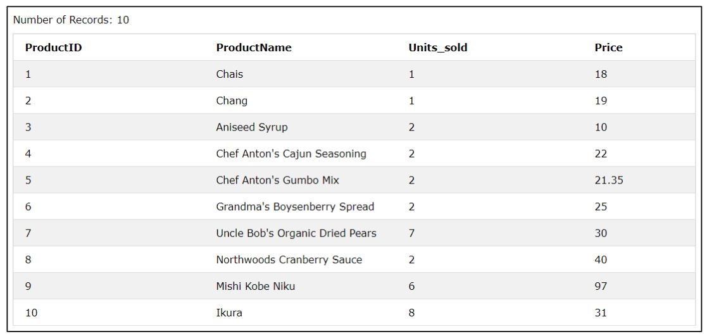
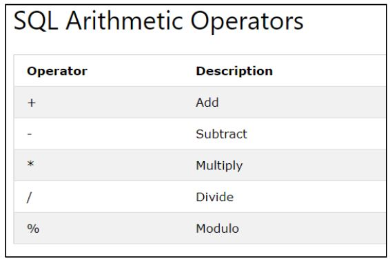
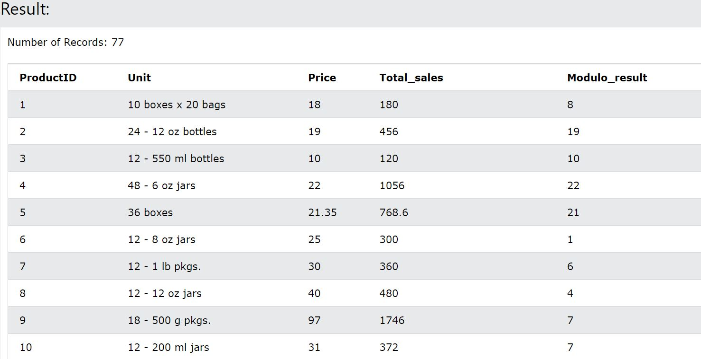
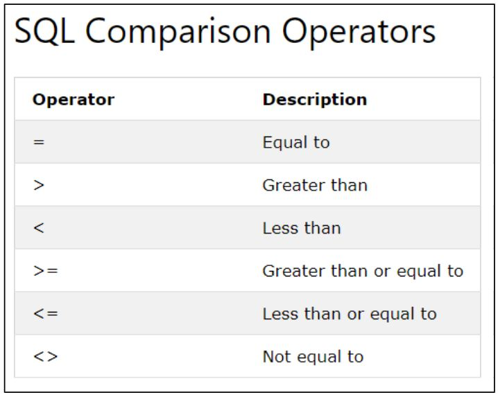
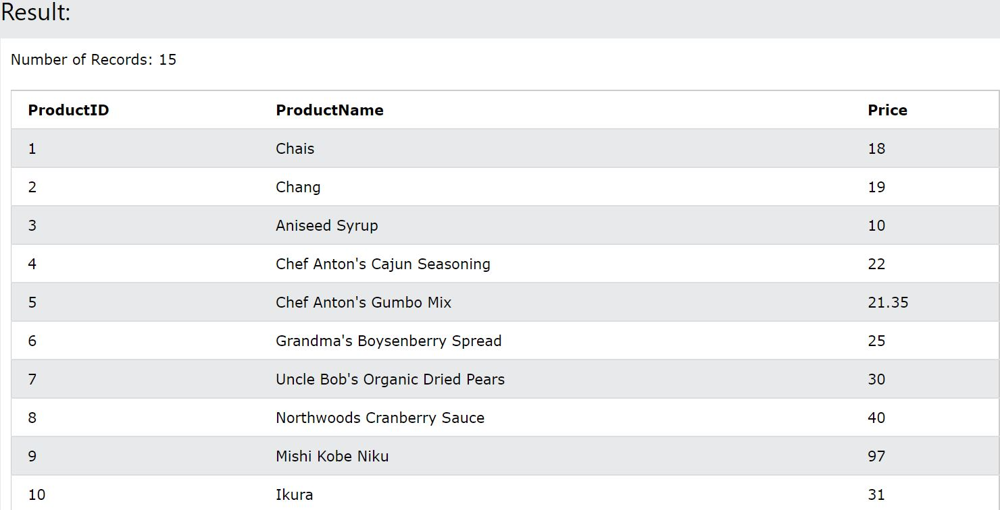
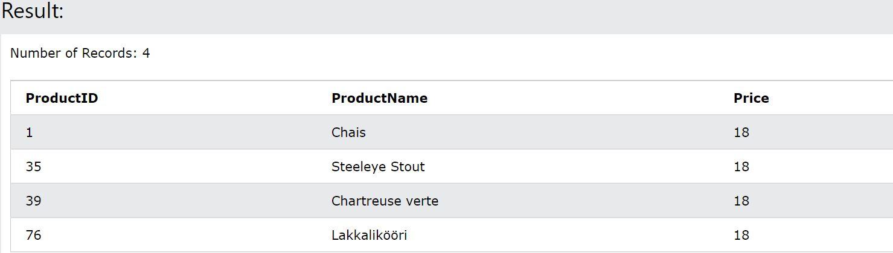
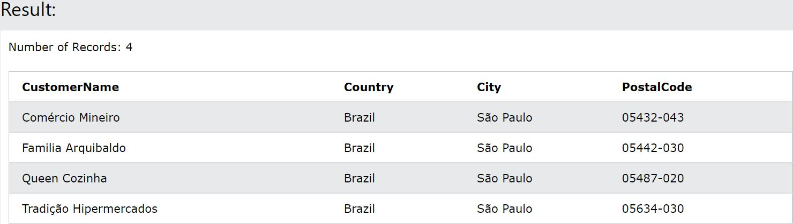
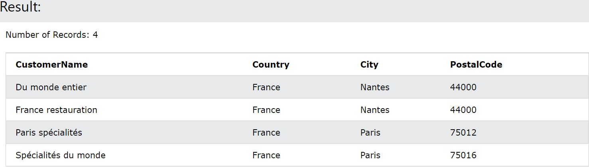
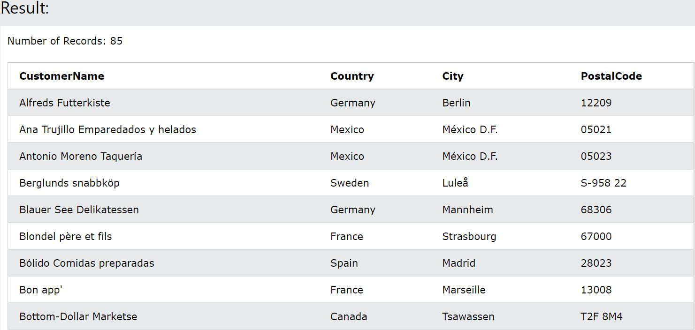

## OPERATORS

The  operators help  perform  operations on the  data  in  the table. They  can  be  used  to  perform arithmetic operations or filter based on certain conditions.

Consider the below table:



### ARITHMETIC OPERATORS:

The arithmetic operators help perform arithmetic operations on the data in the table



#### Example:

```sql
SELECT ProductID, Unit, Price, Price * Unit AS Total_sales, Price % Unit AS Modulo_result FROM Products
```


### COMPARISON OPERATORS:

The  comparison  operators  are  used  to  filter  the  results  based  on  a  condition.  They  are generally passed in the WHERE clause and filters the result based on the condition provided.



#### Syntax:

```sql
SELECT columns FROMv table_name WHERE condition <comparison_operator_of_choice> value
```

#### Examples:

```sql
SELECT ProductID, ProductName, Price FROM Products WHERE ProductID <= 15
```


```sql
SELECT ProductID, ProductName, Price FROM Products WHERE Price = 18
```


### LOGICAL OPERATORS:

SQL has three logical operators which can be used to specify more than one condition in the WHERE clause.

The three operators are:

* AND–Returns results when all the specified conditions are true
* OR–Returns results when at least one of the specified conditions are true
* NOT –Returns results when the opposite of conditions are true

#### Syntax:

```sql
SELECT columns FROM table_name WHERE condition1 AND/OR condition2
```

```sql
SELECT columns FROM table_namem WHERE NOTcondition
```

#### Examples:

```sql
SELECT CustomerName, Country, City, PostalCode
From Customers
Where Country = 'Brazil' AND City = 'São Paulo'
```


```sql
SELECT CustomerName, Country, City, PostalCode
From Customers
Where City = 'Nantes' OR City = 'Paris'
```


```sql
SELECT CustomerName, Country, City, PostalCode
From Customers
Where Not City = 'London'
```



